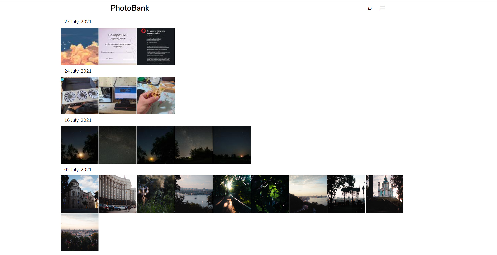

# PhotoBank
A standalone web-servce on flask development server to sort and share your photos through the local network with UI adapted for any devices.

## What is PhotoBank?
PhotoBank is a small open-source project of mine. I decided to create this service after I'd figured out that Google Photos will be providing limited space on the free plan. My goal was to create something that would allow me to upload my photos from phone directly to the server and then to be able to watch all the uploaded photos in one place from every device in my local network. Also, it would be cool to search photos for a creation date.

The service is fully autonomous and doesn't need any Internet connection, all resources (except external libraries) are included in the package. For now it supports English and Russian languages, but you can help me translating it into other languages (see the [locale](locale) folder for examples). Datify allowed the search for photo creation dates in any formats.

> For security reasons service is not allowed to delete or edit photos stored on the drive.

## How to install?
#### Requirements
To run the service, you will need Python 3.
There are some external libraries needed for service functioning: `flask`, `flask-sqlalchemy`, `Pillow` and `exifread`. Also, it needs `datify`, but as it's my own library, I included it in the project files.
> You can freely install all of these through `pip` with this command:
> `pip install flask flask-sqlalchemy Pillow exifread` 

#### Instalation
Just download source from the project's GitHub page and unpack the archive into any folder **on the same drive, where you want to store your photos**. Also, if you was storing your photos in folders, service will automatically add these photos to database and create thumbnails for them.

## Running and setting up the server
#### First run
1. Open the folder, where you unpacked the files of PhotoBank, in explorer.
2. Run `cmd` from that folder.
3. Run `app.py` file with Python (`python app.py`)
4. Copy IP address with port and paste it into the address line of your browser.
5. Success! Now follow the instructions of PhotoBank to change photos storage folder and set server IP into your PC's IP if you want to share your photo library through your local network (**Be careful with public networks!**).
6. After server restart, Windows firewall may ask you permission for PhotoBank to access the network. Press 'Yes', if you need this functionality.

#### Next runs
After the first setting the server up, you can run it just the same way. You can also access the service from other devices in your network if you set server IP to your PC's IP.

## Uploading photos
Open service's homepage and go Menu>Upload photos. Press 'Upload photos' button and select photos you want to upload to your server. Be careful: if you have slow wifi connection, translation of large amounts of hi-res photos can take extremely long time. During the upload you mustn't close the page. (In further updates I will change the way of uploading photos to prevent loosing all the progress in that cases)

##### What will happen with my photos?
After uploading they will be saved into your photos folder, separated into folders named in format *YYYYMMDD*. A low-res thumbnail will be created or every uploaded photo and they will be added to the database. Then you will be redirected to the main page, where you will see the uploaded photos.

